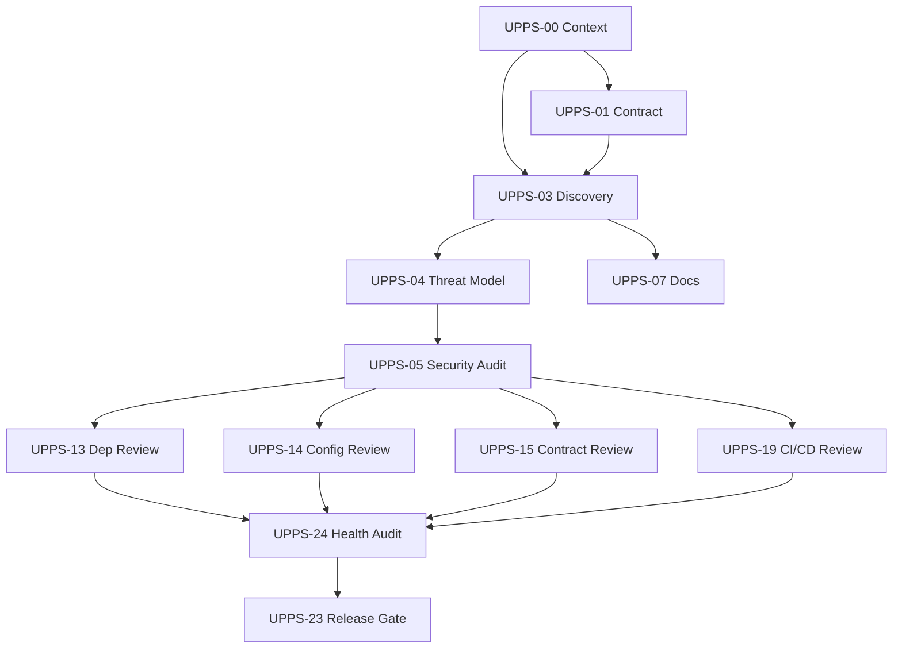

# Specialist Execution Plan

**Project**: lode
**Suite**: universal-project-prompt-suite v3.2.0
**Prompt**: UPPS-02
**Scenario**: 1 — Unknown Repository, Full Assessment
**Generated**: 2026-07-11

## Execution Order

### Phase 1: Security (Mandatory Gate)

```
UPPS-04 Threat Modeling
  ↓
UPPS-05 Master Security Audit
```

**Rationale**: Per the Security Gate chain in PROMPT_EXECUTION_ORDER.md, threat model must precede security audit. Security audit must precede any cleanup, refactoring, dependency changes, or release work.

**Dependencies**: UPPS-03 (discovery data), UPPS-00 (context), UPPS-01 (contract)
**Evidence consumed**: `reports/discovery/project_discovery_report.md`, `artifacts/inventory/component_map.json`
**Expected outputs**:
- `reports/security/threat_model.md`
- `reports/security/security_audit_report.md`
- (potentially) `plans/security/security_remediation_plan.md`

### Phase 2: Specialists (Conditional on UPPS-05 Findings)

After UPPS-05 completes, route these based on findings:

| Prompt | Condition | Inputs Needed |
|---|---|---|
| UPPS-13 Dependency Review | If supply chain risks found in UPPS-05 | `artifacts/inventory/repository_inventory.json` |
| UPPS-14 Config/Secrets Review | If config or secret handling issues found | lode-core config module, env handling |
| UPPS-15 Public Contract Review | If CLI/MCP contract issues found | `docs/reference/index.md`, lode-mcp tools, lode-lsp |
| UPPS-10 Testing Baseline | If regression or coverage issues found | Test source files, CI config |
| UPPS-19 CI/CD Review | If build or release pipeline concerns | `.github/workflows/` |

### Phase 3: Consolidation

```
Selected Specialists (Phase 2)
  ↓
UPPS-24 Project Health Audit
```

**Expected outputs**:
- `reports/project_health/project_health_completeness_audit_report.md`
- `artifacts/project_health/remaining_work_backlog.json`
- `plans/project_health/phased_improvement_plan.md`

### Phase 4: Release Gate (Conditional)

```
UPPS-24
  ↓
UPPS-23 Release Readiness (only if release decision needed)
```

**Expected outputs**:
- `reports/release/release_readiness_report.md`
- `artifacts/release/release_gate_scorecard.json`

## Completed Prompts (Not Rerun)

| Prompt | Status | Output Location |
|---|---|---|
| UPPS-00 | PASS | `.prompt_suite/context/` |
| UPPS-01 | PASS | `.prompt_suite/contracts/` |
| UPPS-03 | PASS | `reports/discovery/`, `artifacts/inventory/` |
| UPPS-07 | PASS | `docs/`, `reports/documentation/`, `artifacts/documentation/` |

## Dependency Graph



## Verification Gates

- **Gate 1**: UPPS-05 must pass (or pass with conditions) before Phase 2 specialists begin
- **Gate 2**: All Phase 2 specialists must complete before UPPS-24 runs
- **Gate 3**: UPPS-24 must pass before UPPS-23 runs
- **Stop condition**: If UPPS-05 finds Critical issues, escalate before proceeding
