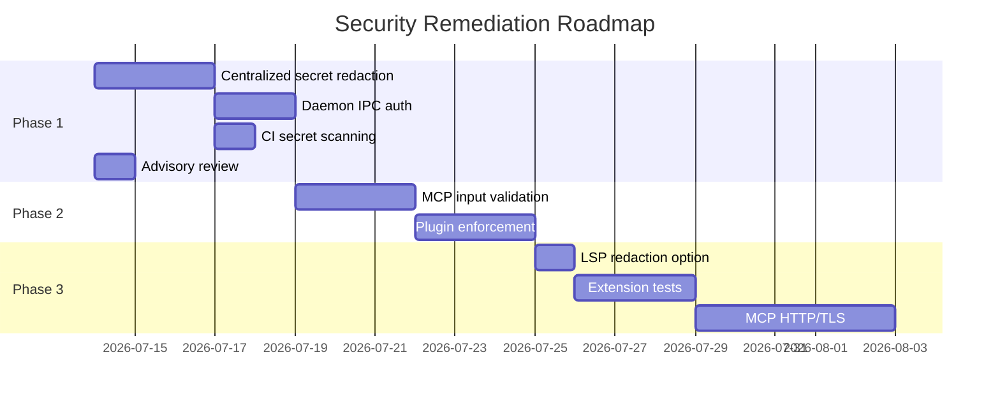

# Security Remediation Roadmap

**Project**: lode
**Suite**: universal-project-prompt-suite v3.2.0
**Prompt**: UPPS-05
**Generated**: 2026-07-11

## Overview

12 findings from UPPS-05 security audit. 1 High, 5 Medium, 2 Low, 4 Informational.
Core security controls (ValidatedRoot, Process, secrets scanner) are strong.
Main gaps: no centralized secret redaction, no daemon IPC auth, no CI secret scanning.

## Phase 1: Immediate (Next Sprint)

### 1.1 Implement Centralized Secret Redaction (F-02)

**Severity**: High
**Effort**: 2-3 days
**Files affected**: lode-core (new module), all crates (integration)

**Plan**:
1. Create `lode-core/src/redact.rs` with `pub fn redact_secrets(input: &str) -> String`
2. Implement patterns from `secrets.rs` (ghp_, github_pat_, AKIA, ASIA, PEM keys)
3. Apply at all output boundaries:
   - `LodeError::Display` implementation in `error.rs`
   - MCP response serialization in `lode-mcp/src/server.rs`
   - CLI output in `lode-cli/src/main.rs`
   - LSP diagnostic content in `lode-lsp/src/lib.rs`
4. Add unit tests for redaction patterns
5. Add integration test that verifies no secrets leak through any output path

**Verification**: `cargo test --workspace` + manual review of error messages

### 1.2 Add Daemon IPC Authentication (F-04)

**Severity**: Medium
**Effort**: 1-2 days
**Files affected**: lode-daemon/src/ipc.rs, lode-core/src/ipc.rs

**Plan**:
1. Generate random 32-byte token on daemon start
2. Write token to `.port`-style sidecar file (`.token`)
3. Require `token` field in IPC request JSON
4. Update lode-cli daemon commands to read token file
5. Update lode-tui IPC client to read token file
6. Add tests for token generation, file I/O, and auth rejection

**Verification**: `cargo test -p lode-daemon` + manual IPC test with/without token

### 1.3 Add Secret Scanning to CI (F-10)

**Severity**: Medium
**Effort**: 0.5 day
**Files affected**: `.github/workflows/ci.yml`

**Plan**:
1. Add step after `build` job: `lode scan secrets .`
2. Use `--fail` flag or check exit code to fail on finding
3. Run on ubuntu-latest only (single matrix entry)
4. Add step to `test` job as post-test check

**Verification**: Push to branch, verify CI output

### 1.4 Review and Document Advisory Ignores (F-06)

**Severity**: Medium
**Effort**: 0.5 day
**Files affected**: `deny.toml`

**Plan**:
1. Check current ratatui version (0.28.1) and its transitive deps
2. If paste/lru still present, add comment with review date and rationale
3. If paste/lru removed, remove ignores
4. Set recurring review reminder (e.g., quarterly)

**Verification**: `cargo deny check` passes

## Phase 2: Short Term (Next 2 Sprints)

### 2.1 Add MCP Input Validation Layer (F-03)

**Severity**: Medium
**Effort**: 2-3 days
**Files affected**: lode-mcp

**Plan**:
1. Add JSON Schema validation for each tool's input parameters
2. Add centralized validation before `dispatch_tool()`
3. Add input logging for audit trail
4. Add per-tool rate limiting (e.g., max 10 calls/minute for mutation tools)
5. Add unit tests for validation and rate limiting

### 2.2 Enforce Plugin Permissions at Runtime (F-05)

**Severity**: Medium
**Effort**: 2-3 days
**Files affected**: lode-cli/src/cmd/plugin.rs, lode-core

**Plan**:
1. Implement runtime permission check before plugin hook execution
2. Block `execute` permission if not explicitly granted
3. Block `network` access if not explicitly granted
4. Block `fs_write` outside project root if not explicitly granted
5. Add 'first-run permission prompt' for new plugins
6. Add tests for runtime enforcement

## Phase 3: Long Term

### 3.1 Add LSP Diagnostics Redaction Option (F-08)

**Severity**: Low
**Effort**: 1 day

**Plan**:
1. Add `lsp.redact_diagnostics` config option
2. When enabled, redact secret values from diagnostic messages
3. Default to `true` (redacted)
4. Add VS Code/Neovim setting documentation

### 3.2 Add Extension Test Suites (F-11)

**Severity**: Low
**Effort**: 2-3 days per extension

**Plan**:
1. vscode-lode: Add Mocha/Jest tests with mock lode binary
2. lode.nvim: Add tests with plenary.nvim test harness
3. Add binary path validation before subprocess execution
4. Add CI job for extension tests

### 3.3 Add MCP HTTP/TLS Transport (F-07)

**Severity**: Low
**Effort**: 3-5 days

**Plan**:
1. Implement HTTP transport using tokio/tiny_http or similar
2. Add TLS support with optional cert configuration
3. Document transport options and security implications

## Cost Summary

| Phase | Items | Estimated Effort |
|---|---|---|
| Phase 1 (Immediate) | Redact, IPC auth, CI scan, advisories | 4-6 days |
| Phase 2 (Short Term) | MCP validation, plugin enforcement | 4-6 days |
| Phase 3 (Long Term) | LSP redact, extension tests, HTTP/TLS | 6-12 days |
| **Total** | 11 items | **14-24 days** |

## Dependency Tracking

## Acceptance Criteria

| Criterion | Verification |
|---|---|
| redact_secrets() implemented and tested | Unit tests pass for all patterns |
| Secret redaction applied to all output boundaries | Integration test confirms no leaks |
| Daemon rejects unauthenticated IPC commands | Integration test confirms rejection |
| CI catches committed secrets | lode scan secrets in CI fails on finding |
| Advisory ignores have documented rationale | deny.toml comments present |
| MCP tools validate input against schema | Schema tests pass for all 38 tools |
| Plugin permissions enforced at runtime | Tests confirm permission blocks |
